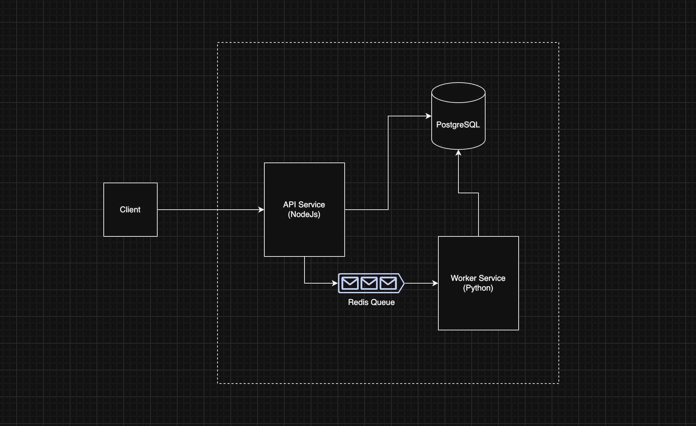

# Prior Authorization Processing System

## Overview

This project implements a Prior Authorization processing system that ingests clinical documents, extracts structured medical evidence, evaluates a simplified medical policy, and produces an auditable Evidence Pack. 

The system mirrors a real world healthcare workflow and emphasizes correctness, auditability, idempotency, and reliability under failure. Document ingestion is synchronous. Evidence extraction and policy evaluation are handled asynchronously using a background worker.

## High Level Architecture

* Three core system components

* API Service
  * Built using Node.js and TypeScript
  * Validates incoming requests
  * Enforces idempotency
  * Ingests documents
  * Exposes read only APIs

* Redis Queue
  * Decouples ingestion from processing
  * Enables retries
  * Provides failure isolation
  * Handles backpressure

* Worker Service
  * Implemented in Python
  * Consumes jobs from Redis
  * Extracts medical evidence
  * Evaluates policy rules
  * Generates Evidence Packs
  * Updates workflow state
  * Writes audit logs

* PostgreSQL
  * System of record
  * Stores workflow state
  * Stores audit logs
  * Stores protected health information



## Core Concepts

### PA Request

* Represents a single prior authorization workflow
* Acts as the central aggregate of the system

* Identifiers
  * External identifier
    * request_uuid
    * UUID exposed to external consumers
  * Internal identifier
    * Integer primary key for internal relationships

* Lifecycle states
  * CREATED
    * Request created and ready for document ingestion
  * PROCESSING
    * Documents ingested and processing in progress
  * EVIDENCE_READY
    * Evidence extraction and policy evaluation completed
  * NEEDS_MORE_INFO
    * Required medical evidence missing or incomplete
  * FAILED
    * Processing failed after retry exhaustion

### Document

* Represents a clinical document uploaded against a PA Request
* Immutable once ingested

* Key characteristics
  * Associated with exactly one PA Request
  * Idempotent uploads enforced using
    * pa_request_id
    * idempotency_key
  * Processed asynchronously
  * Ingestion and processing are decoupled

### Evidence Pack

* Derived artifact created after processing
* Strict one to one relationship with a PA Request

* Contains
  * Structured extracted medical evidence
  * Final decision and human readable explanation
  * Traceability sources linked to documents
  * Processing metadata for audit and debugging

### Processing Jobs

* Tracks execution of background processing
* One job per document processing workflow

* Responsibilities
  * Tracks worker execution attempts
  * Enables controlled retries
  * Routes failed jobs to dead letter queue
  * Provides full traceability and auditability

### Audit Logs

* Immutable records of system activity
* Designed to be safe for external review

* Key properties
  * Append only
  * PHI safe by design
  * Covers major actions including
    * PA request creation
    * Document ingestion
    * Processing state transitions
    * Final decisions

* Enables compliance, debugging, and operational transparency

## Domain Responsibilities

This section outlines the responsibilities and boundaries of each major domain in the system.

```
src/
├── pa-requests/
│   ├── controller.ts
│   ├── service.ts
│   ├── db.ts
│   ├── routes.ts
│   ├── middleware.ts
│   └── types/
│
├── documents/
│   ├── controller.ts
│   ├── service.ts
│   ├── db.ts
│   ├── routes.ts
│   ├── middleware.ts
│   └── types/
│
├── routes/
│   └── index.routes.ts
│
├── config/
│   ├── postgres.ts
│   └── redis.ts
│
├── utils/
│   ├── logger.ts
│   ├── custom.error.ts
│   └── error.handler.ts
```

### PA Requests Domain

* Lifecycle management of prior authorization requests
* Status transitions such as CREATED, PROCESSING, EVIDENCE_READY, NEEDS_MORE_INFO, and FAILED
* Exposure of PA request status to external consumers
* No access to protected health information

### Documents Domain

* Idempotent document ingestion
* Validation and persistence of document metadata
* Dispatching asynchronous processing jobs
* PHI storage delegated exclusively to the phi schema

### Worker Domain  
Python Microservice

* Evidence extraction
* Policy evaluation
* Evidence Pack creation
* Retry and dead letter queue handling
* Audit logging for processing steps

### Domain Ownership Model

Each domain owns

* Its routes
* Its controllers handling request and response mapping only
* Its services containing business logic
* Its repositories responsible for database access
* Its types and enums

### Architectural Guarantees

This structure ensures

* Low coupling between domains
* High cohesion within domains
* Safe and independent evolution of individual domains


## Database Design

The database is split into two schemas.

The core schema stores workflow and control data such as PA requests, documents, processing jobs, Evidence Packs, dead letter jobs, and audit logs.

The phi schema stores protected health information such as document text and extracted evidence.

Externally exposed identifiers are UUIDs.

Internally, integer primary keys are used for relational integrity.

Strong uniqueness constraints enforce idempotency and system invariants.

A strict one to one relationship exists between PA requests and Evidence Packs.

## Database Schema

```sql
BEGIN;

CREATE SCHEMA IF NOT EXISTS core;
CREATE SCHEMA IF NOT EXISTS phi;
CREATE EXTENSION IF NOT EXISTS "pgcrypto";

CREATE TABLE core.pa_requests (
  id SERIAL PRIMARY KEY,
  request_uuid UUID NOT NULL DEFAULT gen_random_uuid(),
  status VARCHAR(32) NOT NULL,
  created_at TIMESTAMP NOT NULL DEFAULT NOW(),
  modified_at TIMESTAMP NOT NULL DEFAULT NOW(),
  created_by VARCHAR(128) NOT NULL,
  modified_by VARCHAR(128) NOT NULL,
  CONSTRAINT uq_pa_requests_request_uuid UNIQUE (request_uuid)
);

CREATE TABLE core.documents (
  id SERIAL PRIMARY KEY,
  document_uuid UUID NOT NULL DEFAULT gen_random_uuid(),
  pa_request_id INTEGER NOT NULL REFERENCES core.pa_requests(id) ON DELETE CASCADE,
  idempotency_key VARCHAR(255) NOT NULL,
  status VARCHAR(32) NOT NULL,
  created_at TIMESTAMP NOT NULL DEFAULT NOW(),
  modified_at TIMESTAMP NOT NULL DEFAULT NOW(),
  created_by VARCHAR(128) NOT NULL,
  modified_by VARCHAR(128) NOT NULL,
  CONSTRAINT uq_documents_pa_idempotency UNIQUE (pa_request_id, idempotency_key),
  CONSTRAINT uq_documents_document_uuid UNIQUE (document_uuid)
);

CREATE TABLE core.processing_jobs (
  id SERIAL PRIMARY KEY,
  job_uuid UUID NOT NULL UNIQUE,
  document_id INTEGER NOT NULL REFERENCES core.documents(id) ON DELETE CASCADE,
  status VARCHAR(32) NOT NULL,
  attempt_count INTEGER NOT NULL DEFAULT 0,
  last_error TEXT,
  trace_id UUID,
  created_at TIMESTAMP NOT NULL DEFAULT NOW(),
  modified_at TIMESTAMP NOT NULL DEFAULT NOW(),
  created_by VARCHAR(128) NOT NULL,
  modified_by VARCHAR(128) NOT NULL
);

CREATE TABLE core.dead_letter_jobs (
  id SERIAL PRIMARY KEY,
  job_uuid UUID NOT NULL,
  document_id INTEGER,
  reason TEXT NOT NULL,
  payload JSONB,
  created_at TIMESTAMP NOT NULL DEFAULT NOW(),
  modified_at TIMESTAMP NOT NULL DEFAULT NOW(),
  created_by VARCHAR(128) NOT NULL,
  modified_by VARCHAR(128) NOT NULL
);

CREATE TABLE core.evidence_packs (
  id SERIAL PRIMARY KEY,
  pa_request_id INTEGER NOT NULL UNIQUE REFERENCES core.pa_requests(id) ON DELETE CASCADE,
  status VARCHAR(32) NOT NULL DEFAULT 'created',
  decision VARCHAR(32),
  explanation TEXT,
  sources JSONB,
  metadata JSONB,
  created_at TIMESTAMP NOT NULL DEFAULT NOW(),
  modified_at TIMESTAMP NOT NULL DEFAULT NOW(),
  created_by VARCHAR(128) NOT NULL,
  modified_by VARCHAR(128) NOT NULL
);

CREATE TABLE core.audit_logs (
  id SERIAL PRIMARY KEY,
  pa_request_id INTEGER REFERENCES core.pa_requests(id) ON DELETE SET NULL,
  actor VARCHAR(128) NOT NULL,
  action VARCHAR(64) NOT NULL,
  metadata JSONB,
  created_at TIMESTAMP NOT NULL DEFAULT NOW(),
  modified_at TIMESTAMP NOT NULL DEFAULT NOW(),
  created_by VARCHAR(128) NOT NULL,
  modified_by VARCHAR(128) NOT NULL
);

CREATE TABLE phi.document_text (
  id SERIAL PRIMARY KEY,
  document_id INTEGER NOT NULL REFERENCES core.documents(id) ON DELETE CASCADE,
  text TEXT NOT NULL,
  created_at TIMESTAMP NOT NULL DEFAULT NOW(),
  modified_at TIMESTAMP NOT NULL DEFAULT NOW(),
  created_by VARCHAR(128) NOT NULL,
  modified_by VARCHAR(128) NOT NULL
);

CREATE TABLE phi.extracted_evidence (
  id SERIAL PRIMARY KEY,
  evidence_pack_id INTEGER NOT NULL REFERENCES core.evidence_packs(id) ON DELETE CASCADE,
  diagnosis VARCHAR(255),
  imaging_present BOOLEAN,
  therapy_attempted BOOLEAN,
  functional_limitation BOOLEAN,
  missing_fields JSONB,
  sources JSONB,
  created_at TIMESTAMP NOT NULL DEFAULT NOW(),
  modified_at TIMESTAMP NOT NULL DEFAULT NOW(),
  created_by VARCHAR(128) NOT NULL,
  modified_by VARCHAR(128) NOT NULL
);

COMMIT;
```


## API Endpoints and Requests

### Create PA Request

Creates a new Prior Authorization request.

```bash
curl -X POST http://localhost:4000/api/v1/pa-requests\
  -H "x-api-key: test-key"
```

### Upload Document

Uploads a clinical document for a PA request.

The Idempotency Key ensures duplicate uploads are safely ignored.

```bash
curl -X POST http://localhost:4000/api/v1/documents/pa-requests/{request_uuid} \
  -H "x-api-key: test-key" \
  -H "Idempotency-Key: doc-001" \
  -H "Content-Type: application/json" \
  -d '{
    "document_text": "Patient has severe knee osteoarthritis..."
  }'
```

### Get PA Request Status

Returns the current request status and the latest Evidence Pack summary.

```bash
curl http://localhost:4000/api/v1/pa-requests/{request_uuid}
```

### Get Audit Logs

Returns the audit trail for a PA request.

Audit responses never include protected health information.

```bash
curl http://localhost:4000/api/v1/audit?request_uuid={request_uuid}
```

## Processing Flow

* Document upload stores metadata and document text
* Processing job is enqueued in Redis
* Worker consumes the job
* Worker tracks execution attempts in processing_jobs
* Evidence is extracted from document content
* Medical policy rules are evaluated
* Evidence Pack is generated
* PA request status is updated
* Audit logs are written for all major state transitions

## Retry and Dead Letter Handling

* Processing failures are retried up to a configured maximum
* Retryable failures are requeued with incremented attempt counts
* Jobs exceeding retry limits are sent to the dead letter queue
* Dead letter jobs are persisted for investigation and auditing

## Security and PHI Handling

* Protected health information is isolated in the phi schema
* Sensitive data is never returned from audit APIs
* In production, PHI fields should be encrypted at rest
* Envelope encryption should be used for key management

## Logging Monitoring and Observability

### What Exists

* Structured logs in API and worker services
* Audit logs stored in the database
* Trace IDs associated with processing jobs

### What Was Omitted Due to Time Constraints

* Centralized log aggregation systems
* Automated alerting pipelines
* Distributed tracing dashboards
* These were intentionally omitted to prioritize correctness and core system design

## What Can Be Improved Further

### Reduce Database Calls

* Batch audit log writes
* Collapse multiple status updates into single transactions
* Use RETURNING clauses to avoid follow up queries

### Introduce Caching Layer

* Cache PA request status
* Cache processing job state
* Use Redis as a read through cache
* Use Redis as a short lived processing state store
* Reduce read load on PostgreSQL

### PHI Encryption

* Encrypt document_text columns
* Encrypt extracted_evidence columns
* Use envelope encryption with KMS managed keys
* Enable zero trust database access

### Worker as Independent Microservice

* Deploy worker independently
* Autoscale based on queue depth
* Allow independent release cycles

### Enhanced ETL and NLP Pipeline

* Current extraction is deterministic
* Introduce multi stage ETL pipelines
* Add LLM based extraction with guardrails
* Add confidence scoring
* Add provenance tracking
* Enable AI readiness without architectural redesign

## Secure Document Handling Design Note

* Document text is stored directly for assignment simplicity
* In production, documents should be stored in object storage
* Access should be provided via pre signed URLs
* API should never expose bucket paths
* Worker should fetch documents only when required
* Prevent bucket wide access leaks
* Prevent accidental PHI exposure
* Prevent long lived credentials

## Running Locally

```bash
docker-compose up -d --build
```

### Services

* API available at [http://localhost:4000](http://localhost:4000)

* PostgreSQL available at localhost:5434

* Redis available at localhost:6379

* PostgreSQL and Redis are started automatically

## Summary

* Models a realistic prior authorization workflow
* Strong emphasis on auditability
* Strong emphasis on reliability
* Strong emphasis on correctness
* Architecture is simple but extensible
* Future enhancements possible without major redesign
